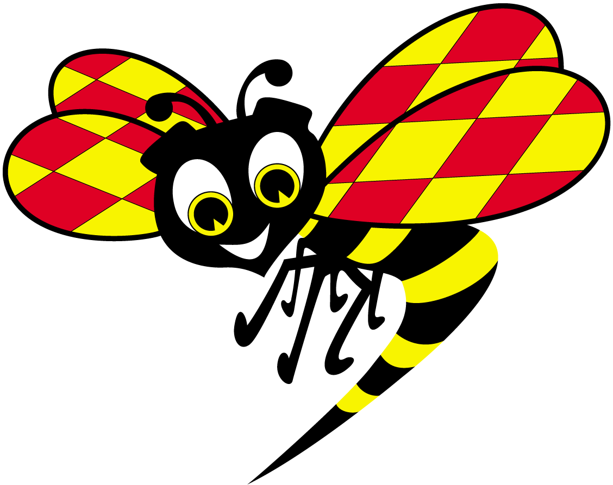

# Flappy Wasp Game

This is a guide for making Flappy Wasp Game. Just follow this guide and at the end you will have created a game!

---


## 0. **Getting Started**

### 0.1. **Download project from GitHub**
Download project by clicking the green button named “Clone or download”. When a small dialogue appears, click “Download ZIP”. Unzip the folder.

### 0.2. **Install Visual Studio Code**
Download Visual Studio Code from https://code.visualstudio.com/, install, and open the unzipped folder.

### 0.3. **Install Live Server**
In Visual Studio Code you can install [Live Server](https://marketplace.visualstudio.com/items?itemName=ritwickdey.LiveServer) as a plugin from the [Visual Studio Code Marketplace](https://marketplace.visualstudio.com/). 

### 0.4. **Start Live Server**
After Live Server is installed, you should be able to click “Go Live” in the bottom right corner of the Visual Studio Code editor.

---


## 1. **Create game**

- We will use a library called **p5.js** to create our game. It is a library people use for creative coding.

- Get started with **p5.js** by visiting https://p5js.org/get-started/.

---

### [NOTE]

- **To help you, we have predefined all methods and variables you need in the JavaScript files.**

- **In the code examples, we will use `// ... (earlier code)` as a comment to let you know when there is written code earlier but we don't want to show all of it.**

---


### 1.1. **Open `index.html`**

- The `index.html` contains `<script>` tags with all the JavaScript files we need to make the game.
- First we add `https://cdn.jsdelivr.net/npm/p5@0.10.2/lib/p5.js`, the **p5.js** library.
- Then all our custom files `index.js`, `wasp.js`, `pipe.js`, and `present.js`.

---


### 1.2. **Open `index.js`**

- We have created a file called `index.js`. This is where our main **methods** and **variables** for our game are predefined.

- Our predefined **variables**;
  - `wasp` – will contain an instance object of the `class Wasp` located in our predefined file `wasp.js`.
  - `pipes` – will contain an instance object of the `class Pipe` located in our predefined file `pipe.js`.
  - `background` – will contain an instance object of the `class Background` located in our predefined file `background.js`.
  - `waspImg` – will contain an image object from `images/wasp.png`.
  - `backgroundImg` – will contain an image object from `images/background.png`.
  - `presentImg` – will contain an image object from `images/present.png`.
  - `isOver` – will contain a boolean if the player has lost the game or not.
  - `score` – will contain an integer with the players score.
  - `CANVAS_HEIGHT` – contains the canvas height.
  - `CANVAS_WIDTH` – contains the canvas width.

- Our predefined **methods**;
  - `preload()` – a **p5.js** method.
  - `setup()` – a **p5.js** method.
  - `draw()` – a **p5.js** method.
  - `keyPressed()` – a **p5.js** method.
  - `startGame()` – a custom method.
  - `gameOver()` – a custom method.
  - `showScores()` – a custom method.

---


### 1.3. **Create a canvas**

- To add a canvas with **p5.js** we can use their `createCanvas()` method and pass our predefined variables `CANVAS_HEIGHT` and `CANVAS_WIDTH` as arguments. [Read documentation here](https://p5js.org/reference/#/p5/createCanvas).

- See example below.

---

**`index.js`**

```js
function setup() {
  createCanvas(CANVAS_WIDTH, CANVAS_HEIGHT);
}
```

---


### 1.4. **Load images**

- Then we want to load some images into our game;
  - `images/background.png` is our background image.
  - `images/wasp.png` is our main character in the game!

- We can use **p5.js** method `loadImage()`. [Read documentation here](https://p5js.org/reference/#/p5/loadImage).

- We pass `"images/background.png"` and `"images/wasp.png"` as arguments to `loadImage()`.

- We assign the return value to our predefined variables `backgroundImg` and `waspImg`.

- See example below.

---

**`index.js`**

```js
function preload() {
  backgroundImg = loadImage("images/background.png");
  waspImg = loadImage("images/wasp.png");
}
```

---

- No images will show yet, but we will get there!

---


## 2. **Create background**


### 2.1. **Open `background.js`**

- We have created a separate file `background.js` to handle all background-related code.
- Our predefined **variables**;
  - `speed` – we will animate the background to move so it will have a speed.
  - `x` – the background's x-axis position.
  - `y` – the background's y-axis position.
  - `width` – the background's width.
  - `height` – the background's height.

- Our predefined **methods**;
  - `show()` – that we will use for drawing the background onto the canvas.
  - `update()` – that we will use for animating the background.

---


### 2.2. **Define drawing**

- Now we have to tell **p5.js** how we want to draw the background on the canvas.
- Use **p5.js**'s `image()` method. [Read documentation here](https://p5js.org/reference/#/p5/image).

- In `background.js`, we start by passing `backgroundImg` as an argument to **p5.js** `image()` method. Remember that we defined the `backgroundImg` variable in the `index.js` file? It is also accessible in this file `background.js` because it is a *global* variable.

- We also pass `class Background`'s `x`, `y`, `width`, `height` as arguments to **p5.js** `image()` function. You may have noticed that we have added `this` keyword before these variables. This is a rule when using class variables inside the class itself.

- See example below.

---

**`background.js`**

```js
show() {
  image(backgroundImg, this.x, this.y, this.width, this.height);
}
```

---


### 2.3. **Create instance**

- To use our `class Background` in our `index.js` file, we must create a new instance object.

- In our `index.js` file, in the `setup()` method, we can use the keyword `new` to create a new instance object and save it in our predefined variable `background`.

- See example below.

---

**`index.js`**

```js
function setup() {
  createCanvas(CANVAS_WIDTH, CANVAS_HEIGHT);
  background = new Background();
}
```

---


### 2.4. **Draw background**

- The most important **p5.js** method for drawing is the `draw()` method! [Read documentation here](https://p5js.org/reference/#/p5/draw).

- If we don't add our `background.show()` here, nothing will show, so let's add it!

- See example below.

---

**`index.js`**

```js
function draw() {
  background.show();
}
```

---

- **We should now see a background image on our canvas!**

---


### 2.5. **Move background**

- We also want our background to move. Let's add some code to our `update()` method in `background.js`.

- See example below.

---

**`background.js`**

```js
update() {
  // This will make the image move to the left.
  this.x -= this.speed;

  // This will make the image loop infinitely by adding a new image when the old one ends.
  if (this.x <= -this.width + CANVAS_WIDTH) {
    image(backgroundImg, this.x + this.width, 0, this.width, this.height);
    if (this.x <= -this.width) {
      this.x = 0;
    }
  }
}
```

---

- Then just add the `background.update()` beneath the `background.show()` in the `index.js` file.

- See example below.

---

**`index.js`**

```js
function draw() {
  background.show();
  background.update();
}
```

---

- **We should now have a moving background!**

---


## 3. **Create wasp**




### 3.1. **`wasp.js`**

- We have created a separate file `wasp.js` to handle all wasp-related code.

- Our predefined **variables**;
  - `speed` – we will animate the wasp to move so it will have a speed.
  - `x` – the wasp's x-axis position.
  - `y` – the wasp's y-axis position.
  - `width` – the wasp's width.
  - `height` – the wasp's height.
  - `gravity` – the wasp will have a gravity for "falling" animation.
  - `lift` – the wasp will have a lift for "jumping" animation.

- Our predefined **methods**;
  - `show()` – that we will use for drawing the image.
  - `update()` – that we will use for animation, in this case, creating gravity.
  - `up()` – that we will use for creating jump animation when user press `Space Bar`.

---


### 3.2. **Define drawing**

- In the Wasp's `show()` method, we want to use **p5.js**’s `image()` method.

- Pass `waspImg`, `this.x`, `this.y`, `this.width`, and `this.height` as parameters.

- See example below.

---

**`wasp.js`**

```js
show() {
  image(waspImg, this.x - 16, this.y - 16, this.width, this.height);
}
```

---


### 3.3. **Create instance**

- We must first create an instance object of `Wasp` in `index.js` to use it there.

- Assign the instance object to our predefined variable `wasp`.

- See example below.

---

**`index.js`**

```js
function setup() {
  createCanvas(CANVAS_WIDTH, CANVAS_HEIGHT);
  background = new Background();
  wasp = new Wasp();
}
```

---


### 3.4. **Draw wasp**

- Let's add our `wasp.show()` method.

- We should now see a wasp image on our canvas!

- We must also call the `wasp.show()` in `index.js` to draw the wasp.

- See example below.

---

**`index.js`**

```js
function draw() {
  // ... (earlier code)

  wasp.show();
}
```

---


### 3.5. **Add gravity**

- The wasp should fall to the ground because it is affected by gravity! 

- In `wasp.js`, we need to use `this.gravity`, `this.y`, and `this.speed` to create a falling wasp.

- See example below.

---

**`wasp.js`**

```js
update() {
  this.speed += this.gravity;
  this.y += this.speed;
}
```

---

- **Don't forget to call `wasp.show()` in `index.js`!**

- See example below.

---

**`index.js`**

```js
function draw() {
  // ... (earlier code)

  wasp.show();
  wasp.update();
}
```

---

- **We should now have a falling wasp!**

---


### 3.6. **Add jumping wasp**

- Now the wasp is just falling. It must be able to fly!

- Use the p5.js function named [keyPressed()](https://p5js.org/reference/#/p5/keyPressed) in `index.js`.

- Check if the space bar key is pressed, then call the `wasp.up()` function.

- See example below.

---

**`index.js`**

```js
function keyPressed() {
  if (key === " ") {
    wasp.up();
  }
}
```

---

- Nothing is happening when calling the `wasp.up()` function? We need to add some code to it!

- In `wasp.js`, go to `up()`.

- We can make the wasp fly by adding a positive lift force to `this.speed`.

- See example below.

---

**`wasp.js`**

```js
up() {
  this.speed += this.lift;
}
```

---

- **We should now have a jumping wasp!**

---


### 3.7. **Stop wasp from falling outside canvas**

- At the moment the wasp just disappears when falling outside the canvas.

- To stop the wasp from falling outside the canvas, we can add some code to the `update()` in `wasp.js`.

- See example below.

---

**`wasp.js`**

```js
update() {
  // ... (earlier code)

  if (this.y > CANVAS_HEIGHT) {
    this.y = CANVAS_HEIGHT;
    this.speed = 0;
  }

  if (this.y < 0) {
    this.y = 0;
    this.speed = 0;
  }
}
```

---


## 4. **Create pipes**

We want the wasp to move past obstacles, like the pipes in Flappy Bird.


### 4.1. **Open `pipe.js`**

- We have created a separate file `pipe.js` to handle all pipe-related code.

- Our predefined **variables**;
  - `speed` contains the pipe speed.
  - `top` contains an object with properties for the upper pipe.
  - `bottom` contains an object with properties for the lower pipe.

- Our predefined **methods**;
  - `show()` will be used for drawing an upper and lower pipe.
  - `update()` will be used for animation, in this case, moving the pipes from right to left on the canvas.
  - `hits()` will be used for checking if our wasp hits a pipe.
  - `pass()` will be used for checking if our wasp passes (NOT hits) a pipe.
  - `offscreen()` will be used for checking of the pipe has moved outside the canvas.

---


### 4.2. **Create instance**

- We must first create an instance object of `Pipe` in `index.js`.

- In this case, we want to add our pipe to an array. Because we want to continuosly add new pipes to show when a pair of pipes has moved offscreen. We use our predefined variable `pipes` and give it a value of an empty array.

- See example below.

---

**`index.js`**

```js
function setup() {
  // ... (earlier code)

  pipes = [];
  pipes.push(new Pipe());
}
```

---


### 4.3. **Define drawing**

- We want to draw a pair of pipes at the top and the bottom of the canvas.

- First, we use **p5.js** `fill()` method to define which color to use. [Read documentation here](https://p5js.org/reference/#/p5/fill).

- Then we add two rectangles by using **p5.js** `rect()` method. [Read documentation here](https://p5js.org/reference/#/p5/rect).

- See example below.

---

**`pipe.js`**

```js
show() {
  fill(121, 85, 72);
  rect(this.x, 0, this.width, this.top.height);
  rect(this.x, CANVAS_HEIGHT - this.bottom.height, this.width, this.bottom.height);
}
```

---


### 4.4. **Show pipes**

- Because we have an array of pipes, we need to loop the array to be able to call the `pipe.show()`.

- See example below.

---

**`index.js`**

```js
function draw() {
  // ... (earlier code)

  for (let pipe of pipes) {
    pipe.show();
  }
}
```

---


### 4.5. **Add movement to pipes**

- In `pipe.js`, we can add movement to the pipes by subtracting `this.speed` (the pipe's speed) from `this.x` (the pipes x position).

- See example below.

---

**`pipe.js`**

```js
update() {
  this.x -= this.speed;
}
```

---

- Don't forget to also call the `pipe.update()` function in `index.js` inside the `draw()` method.

- See example below.

---

**`index.js`**

```js
function draw() {
  // ... (earlier code)

  for (let pipe of pipes) {
    pipe.show();
    pipe.update();
  }
}
```

---


### 4.6. **Repeatedly add new pipes**

- Now we only get two pipes and then nothing more?

- Now we want a new present to generate each 100% of the frame.

- Check [frameCount](https://p5js.org/reference/#/p5/frameCount) and push a new Pipe to `pipes` in `index.js` inside the `draw()` method.

- See example below.

---

**`index.js`**

```js
function draw() {
  // ... (earlier code)

  for (let pipe of pipes) {
    // ... (earlier code)
  }

  // Check when frameCount is 100%.
  if (frameCount % 100 == 0) {
    pipes.push(new Pipe());
  }

}
```

---

## 5. **Game over**

- It's game over when you hit a pipe.

### 5.1. **Check if wasp hits pipe**

- So we should check in `index.js` inside `draw()` if we are actually hitting a pipe.

- See example below.

---

**`index.js`**

```js
function draw() {
  // ... (earlier code)

  for (let pipe of pipes) {
    pipe.show();
    pipe.update();

    // Check if the wasp hit a pipe.
    if (pipe.hits(wasp)) {
      gameOver();
    }
  }

  // ... (earlier code)
}
```

---

- Now we need to add some code to `hits()` in `pipe.js` to check if wasp is hitting a pipe.

---

**`pipe.js`**

```js
hits() {
  // Check if the wasp is touching a top or bottom pipe y position.
  if (wasp.y < this.top.height || wasp.y > CANVAS_HEIGHT - this.bottom.height) {
    
    // Check if the wasp is touching a top pipe x position.
    if (wasp.x > this.top.x && wasp.x < this.top.x + this.top.width) {
      return true;
    }

    // Check if the wasp is touching a bottom pipe x position.
    if (wasp.x > this.bottom.x && wasp.x < this.bottom.x + this.bottom.width) {
      return true;
    }
  }

  // Else just return false – the wasp is not touching a pipe.
  return false;
}
```

---


- Now, our `if (pipe.hits(wasp))` in `index.js` should return true when the wasp is hitting i pipe. Now we can add a game over screen.

- In `index.js` `gameOver()` method, we will add following...
  - Set our text size using **p5.js** [textSize()](https://p5js.org/reference/#/p5/textsize) method.
  - Set our fill color using **p5.js** [fill()](https://p5js.org/reference/#/p5/fill) method.
  - Add a text "GAME OVER" using **p5.js** [text()](https://p5js.org/reference/#/p5/text) method.
  - Set our predefined variable `isOver` to true. We will use it later in `index.js` `keyPressed()` method.
  - To actually end the game so it stops looping, add **p5.js** [noLoop()](https://p5js.org/reference/#/p5/noLoop) method.

- See example below.

---

**`index.js`**

```js
function gameOver() {
  textSize(50);
  fill(000);
  text("GAME OVER", 50, 300);
  isOver = true;
  noLoop();
}
```

---

- **We should now show a game over screen when we hit a pipe!**

---

- We want to start a new game when the player presses the `Space` key.

- In `index.js`, check if `isOver` is true inside the `keyPressed()` method. If true, run `startGame()` to start a new game.

- See example below.

---

**`index.js`**

```js
function keyPressed() {
  if (key === " ") {
    wasp.up();
    if (isOver) {
      startGame();
    }
  }
}
```

---


## 6. **Create score**

- Of course we want to show off our score and here we will check if the wasp has passed a pipe and add a score.

- Here we should add more logic in the for-loop in `index.js`, that goes through each pipe which we just did in the step above!

- See example below.

**`index.js`**

```js
function draw() {
  // ... (earlier code)

  for (let pipe of pipes) {
    // ... (earlier code)

    // Check if wasp passes a pipe.
    if (pipe.pass(wasp)) {
      score++;
    }
  }

  // ... (earlier code)
}
```

---

- We also have to use the score variable in `startgame()`, so the score starts at 0.

- See example below.

---

**`index.js`**

```js
function startGame() {
  backgroundX = 0;
  pipes = [];
  wasp = new Wasp();
  pipes.push(new Pipe());
  isOver = false;
  score = 0;
  loop();
}
```

---


### 6.1. **Display score**

- In `showScores()` we want to display the score, which is plain text, here we can use p5 function's, such as [text()](https://p5js.org/reference/#/p5/text) function.

- We have to pass in the text, variable and position. The position can be e.g 1, 32.

- Feel free to play around with the different function's but we will come a long way with text size and color.

- See example below.

---

**`index.js`**

```js
function showScores() {
  fill(000);
  textSize(32);
  text("Score: " + score, 1, 32);
}
```

---


### 6.2 **Call the score function**

- Do not forget to call the `showScores()` we just created in `index.js`. Call the function inside the for-loop that goes through each pipe, without this step nothing will happen.

- See example below.

---

**`index.js`**

```js
showScores();
```

---


## 7. **Create presents**


- We want something that the wasp can collect to get extra score. To make the game more christmas-y we can generate christmas presents that randomly flies against the wasp. But this time, compared to the pipes, we actually want to hit each present to be able to get extra score. 

- To start off with the presents we jump to `index.js` where we find a global variable in the top called `presentImg;`. Next up we want to use the variable and set to a [loadImage()](https://p5js.org/reference/#/p5/loadimage), which is a magical p5 function, and take the present.png image which you will find in the images folder and use it inside of the `preload()`.

- See example below.

---

**`index.js`**

```js
function preload() {
  waspImg = loadImage("images/wasp.png");
  backgroundImg = loadImage("images/background.png");
  presentImg = loadImage("images/present.png");
}
```

---


### 7.1. **Show presents**

In `present.js` we have to functions: `show()` and `update()`. Now we actually want to show the presents so add the present variable, x, y, width and height as parameters in the show function.

The `update()` will update the presents so they start moving from right to left of the canvas. Take the x variable and substract with the speed variable.

- See example below.

---

**`present.js`**

```js
show() {
  image(presentImg, this.x, this.y, this.width, this.height);
}

update() {
 this.x -= this.speed;
}
```

---

When the steps above is completed we actually have to draw the presents in `function draw()` in `index.js`. To draw infinite loops of present we have to loop through all presents and for each present call the `show()` and `update()`.

- See example below.

---

**`index.js`**

```js
for (let i = presents.length-1; i >= 0; i--) {
  presents[i].show();
  presents[i].update();
}
```

---


### 7.2 **Hit detection**

- At this point we want something to happen when the wasp actually hits a present. Here we must do a calculation, a quite similar one to the calculation for the hit detection for the pipes. Use `hits(wasp)` in `present.js`.

- We must check if the height of the wasp is greater than the presents height and... you try to finish the calculation ;).  
Write a `console.log` in the if-statement to check if it works.

- See example below.

---

**`present.js`**

```js
hits(wasp) {
  if (wasp.y > this.y && wasp.y < this.y + this.height) {
    if (wasp.x > this.x && wasp.x < this.x + this.width) {
      console.log("HITS");
     return true;
    }
  }
 return false;
}
```

---

- Now we want a new present to generate each 75% of the frame, use [frameCount()](https://p5js.org/reference/#/p5/frameCount) and push the presents to `christmasPresent()` in `index.js`.

- See example below.

---

**`index.js`**

```js
if (frameCount % 75 == 0) {</b>
  presents.push(new christmasPresent());
}
```

---


### 7.3 **Get extra score**

- To make the game more fun we can set that the user will get extra score when hitting a present.

- Add extra score in `index.js` in the for-loop we created in 5.1.

- See example below.

---

**`index.js`**

```js
for (let i = presents.length-1; i >= 0; i--) {
  presents[i].show();
  presents[i].update();
  if (presents[i].hits(wasp)) {
    score += 3;
    presents.splice(i, 1);
  }
}
```

---


### 7.4 **Reset presents**

- When we start a new game we want the presents array to be empty. Add an empy array in `index.js` in the `startgame()`:

- See example below.

---

**`index.js`**

```js
function startgame() {
  backgroundX = 0;
  pipes = [];
  wasp = new Wasp();
  pipes.push(new Pipe());
  isOver = false;
  score = 0;
  loop();
  presents = [];
  presents.push(new christmasPresent());
}
```

---

## 8. **DONE!**

### 8.1. **More ideas**

- If you are done, but still have time left? Try implementing your own ideas or try out these below;
  - Make the wasp fly faster and faster as the game progresses.
  - Experiment with the physics of the wasp, such as gravity and lift.
  - Show a high score-list of best scores.
  - Make a start screen, to show before the game starts.


_Note: This project is inspired by 
[The Coding Train](https://thecodingtrain.com/). Check him out - he has many more fun coding challenges like this on his YouTube channel!_
